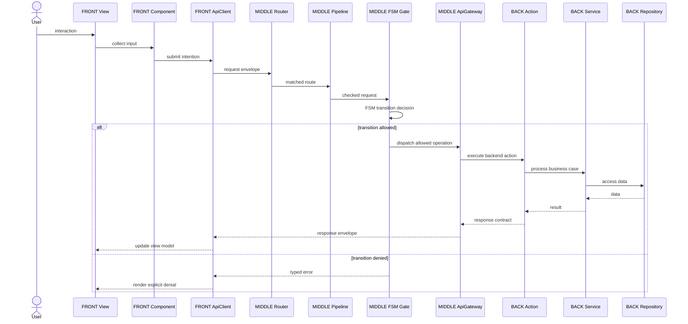
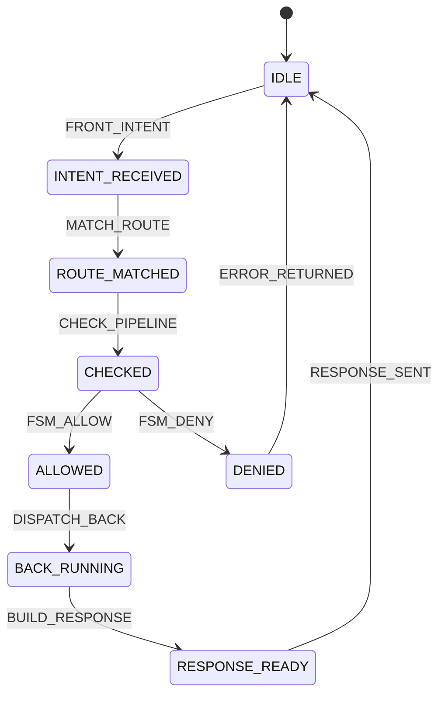

# P117SITE24 — FRONT / MIDDLE / BACK / COMMON boundaries

## Goal

Make OPUS visibly secure and clean by design at framework-tree level. The framework must show clear architectural boundaries instead of hiding them in generic folders.

## Mandatory framework tree

```text
framework/Opus/
├── FRONT/
├── MIDDLE/
│   └── FSM/
├── BACK/
└── COMMON/
```

## Boundary rules

- `FRONT` owns representation only.
- `MIDDLE` owns route transport, request/response contracts, API boundary, checks, audit and FSM gates.
- `BACK` owns business processing, data, runners, jobs, workers and external adapters.
- `COMMON` owns strict shared language only.
- `COMMON` is never a catch-all folder.
- The FSM is the mandatory processor for every operation path.

## UML package diagram

```mermaid
classDiagram
    namespace FRONT {
      class View
      class Layout
      class Section
      class Component
      class ApiClient
    }

    namespace MIDDLE {
      class Router
      class ApiGateway
      class MiddlewarePipeline
      class FsmGate
      class RequestContract
      class ResponseContract
    }

    namespace BACK {
      class Module
      class Action
      class Service
      class Repository
      class Runner
      class Job
      class Worker
      class ExternalAdapter
    }

    namespace COMMON {
      class BoundaryContractInterface
      class RequestEnvelope
      class ResponseEnvelope
      class OperationResult
      class TypedError
      class LayerName
    }

    View --> ApiClient
    ApiClient --> Router
    Router --> MiddlewarePipeline
    MiddlewarePipeline --> FsmGate
    FsmGate --> ApiGateway
    ApiGateway --> Action
    Action --> Service
    Service --> Repository
    Service --> Runner
    Action --> ResponseContract

    FRONT ..> COMMON
    MIDDLE ..> COMMON
    BACK ..> COMMON
```

## End-to-end sequence



## FSM transition graph



## COMMON anti catch-all rule

A file may enter `COMMON` only if all statements are true:

1. It is shared language used across at least two layers.
2. It contains no rendering logic.
3. It contains no route dispatch logic.
4. It contains no access-control decision.
5. It contains no business workflow.
6. It contains no repository, database, runner, job or worker logic.
7. It is stable and reusable.

If one statement is false, the file belongs in `FRONT`, `MIDDLE` or `BACK`, not in `COMMON`.

## Autodocumentation contract

Every architecture-bearing feature must provide:

- a human documentation page under `DOC/`,
- a Mermaid package or class diagram,
- a Mermaid sequence diagram for the request path when relevant,
- a Mermaid FSM diagram when a transition path exists,
- a machine-readable FSM transition contract when transitions are part of runtime behavior,
- a smoke test proving the docs and machine-readable contracts are present.
