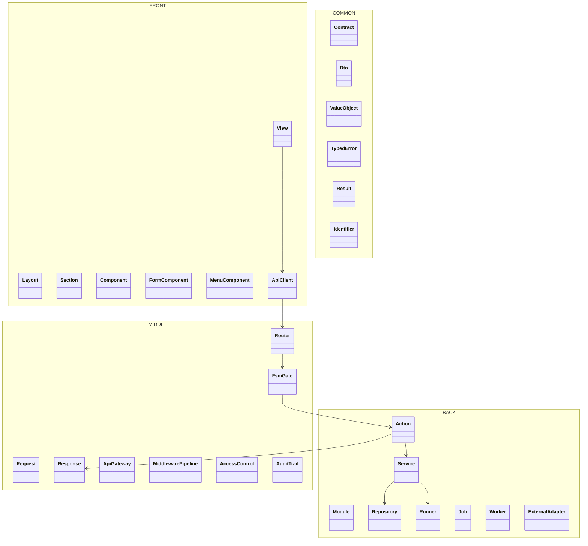
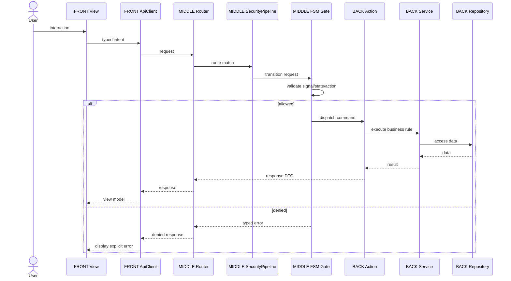
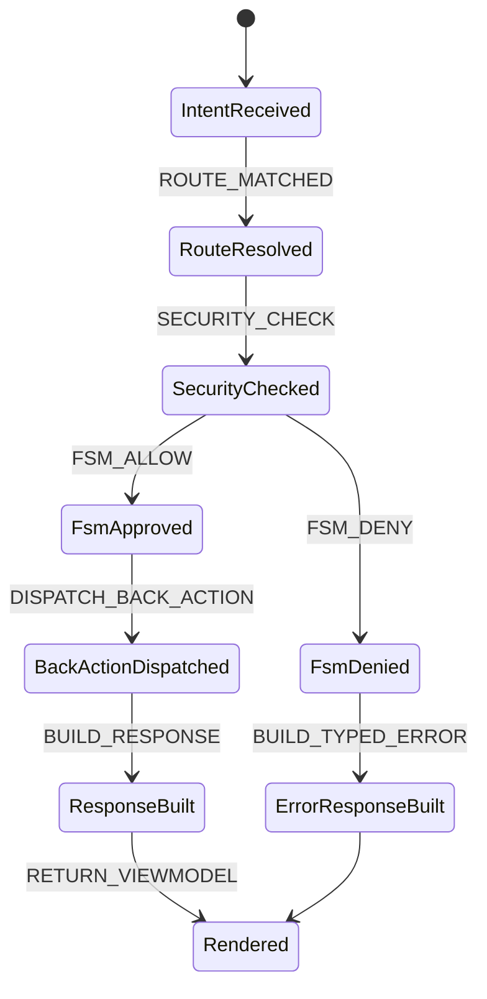

# P117SITE25C — OPUS physical FRONT / MIDDLE / BACK / COMMON tree

## Status

DELIVERED.

This milestone fixes the previous partial state where boundary folders existed but the legacy root directories still remained directly under `framework/Opus`.

The target is a physically visible framework tree:

```text
framework/Opus/
├── FRONT/
├── MIDDLE/
├── BACK/
└── COMMON/
```

No other root directory is allowed under `framework/Opus`, except limited root files such as `README.md`, `BOUNDARY_MAP.json`, and boundary documentation files.

## Non-negotiable rules

- `FRONT` is representation only.
- `MIDDLE` is routing, transport, security, request/response contracts, FSM gates and orchestration.
- `BACK` is business processing, modules, data access, runners, jobs, workers and external adapters.
- `COMMON` is strict shared language only.
- `COMMON` is not a catch-all.
- Every end-to-end operation must pass through the FSM.
- Unknown root directories are refused. They are not silently moved to `COMMON`.

## Mermaid package diagram



## Mermaid end-to-end sequence



## Mermaid FSM transition contract



## Validation

Run:

```cmd
python tools\refactor_p117site25c_front_middle_back_common_physical_tree.py --write
python tools\smoke_p117site25c_front_middle_back_common_physical_tree.py
```

Expected final marker:

```text
P117SITE25C_FRONT_MIDDLE_BACK_COMMON_PHYSICAL_TREE_SMOKE_OK
```
