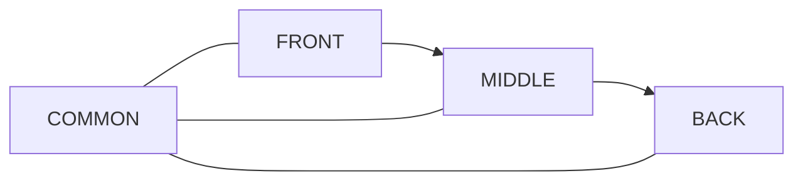

# P117SITE25D Physical boundary migration real

This document defines the real physical framework tree target:

```text
framework/Opus/
  FRONT/
  MIDDLE/
  BACK/
  COMMON/
```

Mermaid diagrams are mandatory for architecture documentation and FSM transition documentation.


