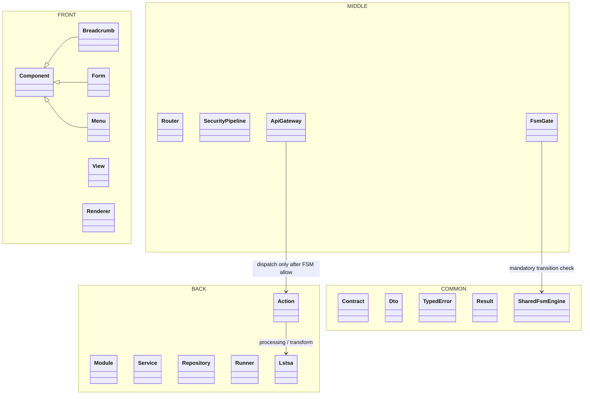
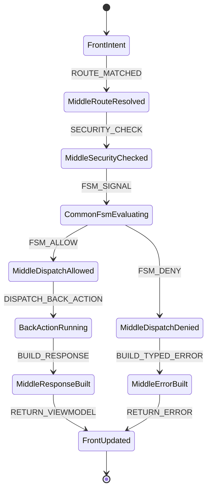

# P117SITE25E — Boundary classification tuning

## Status

DELIVERED.

## Goal

Refine the physical OPUS boundary tree after P117SITE25D.

The target tree remains visually strict:

```text
framework/Opus/
├── FRONT/
├── MIDDLE/
├── BACK/
└── COMMON/
```

But the inner classification is corrected:

- `Breadcrumb`, `Form`, and `Menu` are FRONT components and must live under `FRONT/Component/*`.
- `Fsm` is a shared mandatory processor and must live under `COMMON/FSM/Engine`.
- `MIDDLE` owns the FSM gates and transport orchestration, not the common FSM engine.
- `Lstsa` is a processing / transform engine and must live under `BACK/Lstsa`.
- `COMMON` remains strict shared language and shared processors only; it must never become a catch-all.

## UML package diagram



## FSM transition diagram



## End-to-end rule

```text
FRONT intent
  -> MIDDLE route + security + FSM gate
    -> COMMON FSM engine evaluates signal/state/action/transition
      -> MIDDLE dispatch allowed or denied
        -> BACK action only if transition is allowed
```

No operation path may bypass the FSM.

## Applied physical moves

```text
FRONT/Breadcrumb      -> FRONT/Component/Breadcrumb
FRONT/Form            -> FRONT/Component/Form
FRONT/Menu            -> FRONT/Component/Menu
COMMON/Lstsa          -> BACK/Lstsa
MIDDLE/FSM/Engine     -> COMMON/FSM/Engine
```

## Validation

Run:

```cmd
python tools\refactor_p117site25e_boundary_classification_tuning.py --write
python tools\smoke_p117site25e_boundary_classification_tuning.py
```

Expected final marker:

```text
P117SITE25E_BOUNDARY_CLASSIFICATION_TUNING_SMOKE_OK
```
