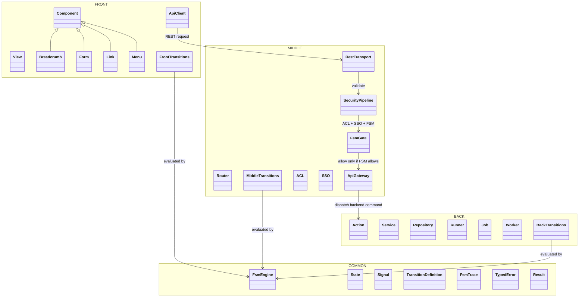
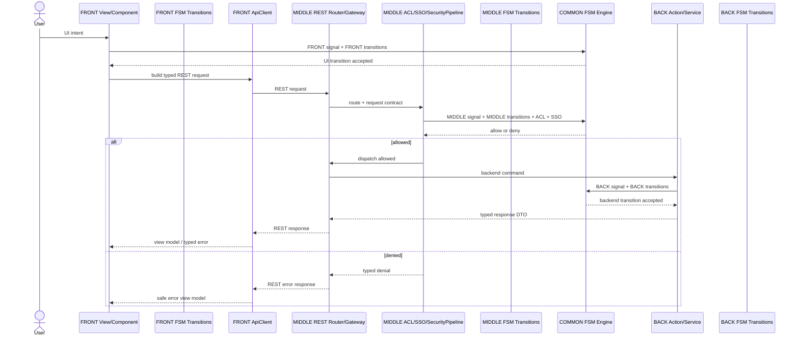
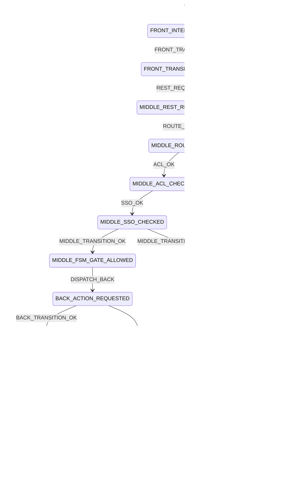

# P117SITE25F — FSM engine, layer transitions and REST security chain

## Status

DELIVERED.

## Goal

Clarify and enforce the OPUS architecture where the FSM engine is shared but the transition fuel is dedicated to each boundary and each generated application.

This corrects the previous ambiguity:

- `COMMON/FSM/Engine` owns the reusable FSM processor.
- `COMMON/FSM/Engine` must not contain layer-specific or application-specific transitions.
- `FRONT/FSM/Transitions` owns UI and representation transitions.
- `MIDDLE/FSM/Transitions` owns routing, REST transport and security transitions.
- `BACK/FSM/Transitions` owns business, data, jobs, workers and external-adapter transitions.
- A generated application may declare its own `frontend/fsm/transitions`, `middle/fsm/transitions` and `backend/fsm/transitions`.
- `Link` is a `FRONT/Component`, like `Breadcrumb`, `Form` and `Menu`.

## Physical target

```text
framework/Opus/
├── FRONT/
│   ├── Component/
│   │   ├── Breadcrumb/
│   │   ├── Form/
│   │   ├── Link/
│   │   └── Menu/
│   └── FSM/
│       └── Transitions/
├── MIDDLE/
│   └── FSM/
│       └── Transitions/
├── BACK/
│   └── FSM/
│       └── Transitions/
└── COMMON/
    └── FSM/
        └── Engine/
```

## Package UML



## End-to-end sequence



## FSM transition diagram



## Non-negotiable documentation rule

Mermaid diagrams are not optional.

Each architecture feature must include:

1. a package/class diagram when boundaries or class responsibilities change;
2. a sequence diagram when a flow crosses boundaries;
3. a `stateDiagram-v2` when FSM transitions are involved;
4. a machine-readable transition definition whenever FSM behavior is introduced or modified;
5. a smoke that verifies the expected documentation markers.

## REST + FSM + ACL + SSO rule

The mandatory end-to-end chain is:

```text
FRONT -> MIDDLE -> BACK -> MIDDLE -> FRONT
```

The transport between `FRONT` and `MIDDLE` is REST. The `MIDDLE` layer owns the REST route, request contract, response contract, ACL check, SSO check, security pipeline and FSM gate.

`BACK` never receives a direct call from `FRONT`. It receives only a command already authorized by `MIDDLE` and accepted by the FSM engine using BACK-specific transition definitions.

## COMMON rule

`COMMON/FSM/Engine` is the shared processor. It may contain FSM engine contracts, states, signals, transition definitions, traces and typed result primitives.

`COMMON/FSM/Engine` must not contain:

- frontend transition files;
- middle transition files;
- backend transition files;
- generated application transitions;
- module-specific transitions.

Layer and application transition files are fuel. The engine consumes them but does not own them.
