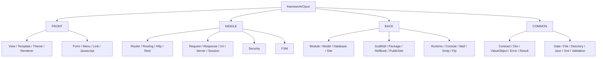
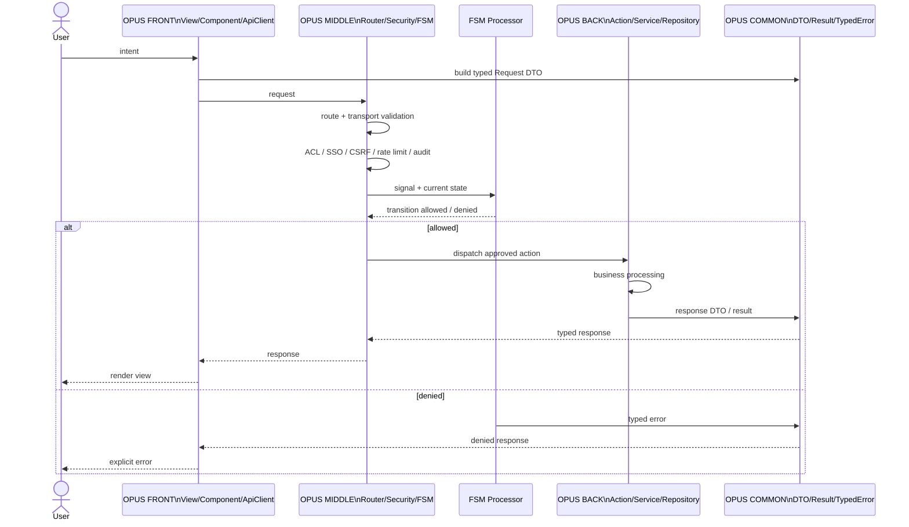
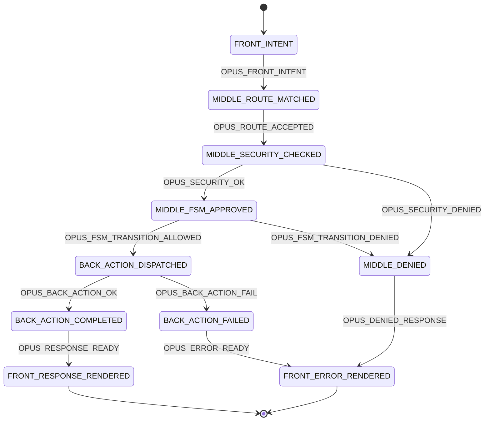

# P117SITE25 — OPUS physical FRONT / MIDDLE / BACK / COMMON reorganization

## Status

DELIVERED — physical reorganization runner and smoke delivered.

## Intent

OPUS must visually and physically expose its architectural boundaries at framework level:

```text
framework/Opus/
├── FRONT/
├── MIDDLE/
├── BACK/
└── COMMON/
```

This is not only documentation. The source tree must make the architectural boundaries obvious.

## Non-negotiable rules

- FRONT owns representation only.
- MIDDLE owns routing, transport, security, contracts and FSM gates.
- BACK owns business processing, data access, jobs, runners, workers and external integrations.
- COMMON owns only minimal shared language: contracts, DTO, value objects, typed errors, results, enums, identifiers and pure technical primitives.
- COMMON must never become a catch-all.
- The FSM is the processor at every level. No processing path bypasses it.
- Mermaid UML and FSM transition diagrams are mandatory in architecture documentation.

## Physical boundary map



## End-to-end secure and clean path



## FSM transition contract



## Runner

The migration is intentionally performed by a local runner because it physically moves directories in the working tree.

```cmd
python tools\refactor_p117site25_front_middle_back_common_tree.py --write
```

The runner:

- refuses to run if the git tree is dirty;
- creates FRONT / MIDDLE / BACK / COMMON;
- moves known legacy root folders into the correct layer;
- refuses unknown root framework directories instead of hiding them in COMMON;
- patches composer.json by adding a classmap for the moved source tree;
- runs composer dump-autoload;
- writes framework/Opus/BOUNDARY_MAP.json.

## Smoke

```cmd
python tools\smoke_p117site25_front_middle_back_common_tree.py
```

Expected markers:

```text
CHECK_ONLY_BOUNDARY_ROOTS=OK
CHECK_FRONT_MAPPED=OK
CHECK_MIDDLE_MAPPED=OK
CHECK_BACK_MAPPED=OK
CHECK_COMMON_MAPPED=OK
CHECK_COMMON_NOT_CATCH_ALL=OK
CHECK_COMPOSER_CLASSMAP=OK
CHECK_MERMAID_UML_DOC=OK
CHECK_FSM_TRANSITION_DOC=OK
P117SITE25_FRONT_MIDDLE_BACK_COMMON_TREE_SMOKE_OK
```
