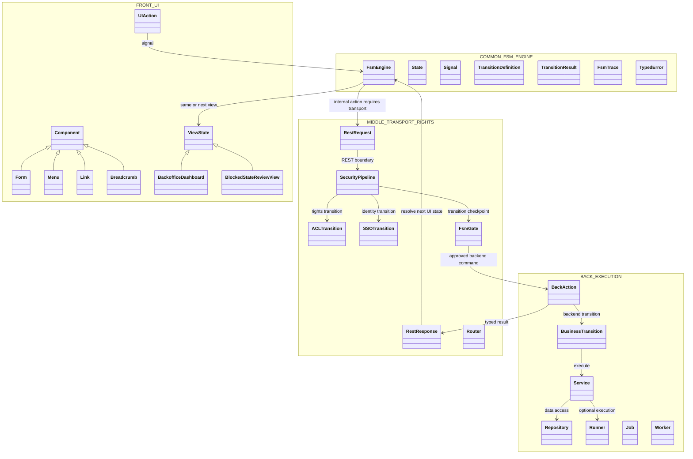
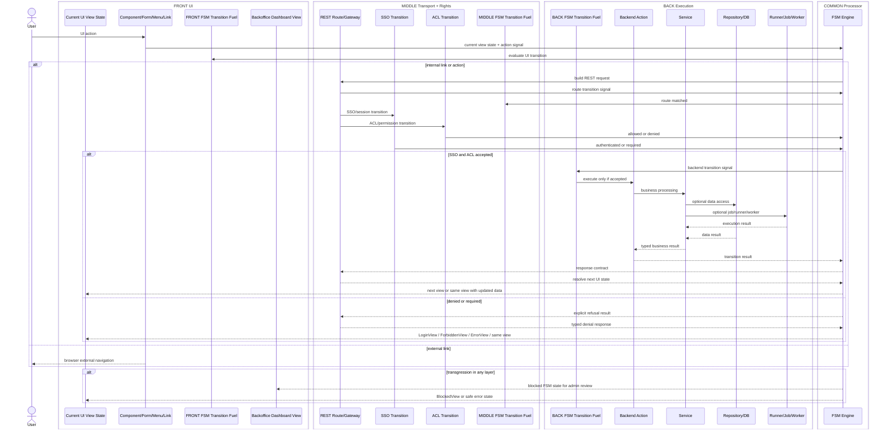
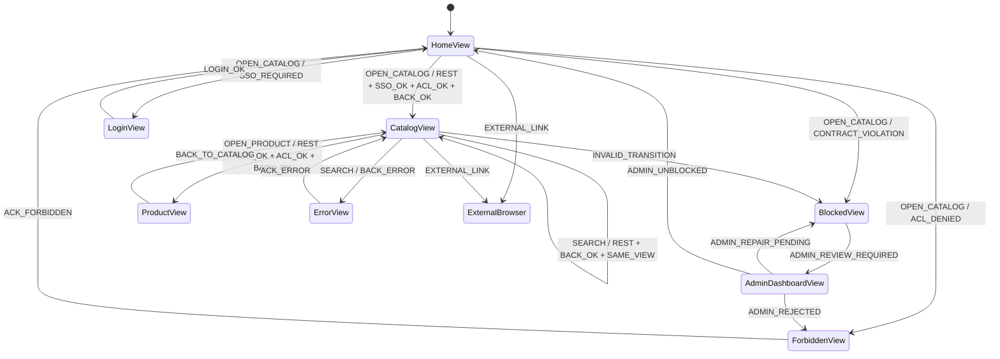

# P117SITE26 — UI View State FSM Pipeline

## Status

DELIVERED.

## Purpose

This palier fixes the OPUS state-processing model.

The FSM is not a cosmetic guard around a request. The FSM is the processor. Every internal user action is a signal, every FRONT view is a UI state, and every internal transition must travel through the end-to-end pipeline:

```text
FRONT -> MIDDLE -> BACK -> MIDDLE -> FRONT
```

The mandatory transport/control chain is:

```text
REST + FSM + ACL + SSO
```

## Layer meaning

```text
FRONT = UI
VIEW = UI FSM state
ACTION = user signal / intent
COMPONENT = UI element that displays state or emits action
```

```text
MIDDLE = transport + rights + orchestration
REST = mandatory internal transport boundary
ACL = permission transition
SSO = identity/session transition
FSM gate = middle transition checkpoint
```

```text
BACK = business execution / data / resources
ACTION/SERVICE/REPOSITORY/RUNNER/JOB/WORKER = backend execution controlled by FSM
```

```text
COMMON = shared language + generic FSM engine
COMMON/FSM/Engine = reusable processor only
COMMON/FSM/Engine owns no application, layer or module transition fuel
```

## Visual target

```text
framework/Opus/
├── FRONT/
│   ├── UI/
│   ├── View/
│   ├── Component/
│   │   ├── Breadcrumb/
│   │   ├── Form/
│   │   ├── Link/
│   │   └── Menu/
│   ├── FSM/
│   │   ├── States/
│   │   │   └── Views/
│   │   └── Transitions/
│   └── Backoffice/
│       ├── Dashboard/
│       └── FSM/
│           ├── States/
│           └── Transitions/
├── MIDDLE/
│   ├── Rest/
│   ├── Security/
│   ├── Router/
│   ├── Request/
│   ├── Response/
│   └── FSM/
│       └── Transitions/
├── BACK/
│   ├── Action/
│   ├── Service/
│   ├── Repository/
│   ├── Runner/
│   ├── Job/
│   ├── Worker/
│   └── FSM/
│       └── Transitions/
└── COMMON/
    └── FSM/
        └── Engine/
```

## UML package diagram



## End-to-end sequence



## UI state diagram



## FSM transition ownership

`COMMON/FSM/Engine` is the processor. It consumes transition definitions but never owns the layer-specific fuel.

```text
COMMON/FSM/Engine
= reusable processor
= state/signal/transition/result/trace primitives
= no UI view transitions
= no REST ACL SSO transitions
= no business transitions
= no application transitions
```

```text
FRONT/FSM/States/Views
= UI view states
= HomeView, CatalogView, ProductView, LoginView, ForbiddenView, BlockedView
```

```text
FRONT/FSM/Transitions
= UI action transitions
= OPEN_CATALOG, OPEN_PRODUCT, SEARCH, BACK_TO_CATALOG, ACK_ERROR
```

```text
MIDDLE/FSM/Transitions
= transport and rights transitions
= REST_REQUEST_RECEIVED, ROUTE_MATCHED, SSO_OK, SSO_REQUIRED, ACL_OK, ACL_DENIED, CSRF_DENIED
```

```text
BACK/FSM/Transitions
= business and execution transitions
= BACK_ACTION_REQUESTED, SERVICE_EXECUTED, REPOSITORY_UPDATED, JOB_QUEUED, RUNNER_FAILED
```

```text
FRONT/Backoffice/FSM/States
= admin UI states
= AdminDashboardView, AdminBlockedStatesView, AdminTransitionInspectorView
```

```text
FRONT/Backoffice/FSM/Transitions
= admin actions
= ADMIN_REVIEW_REQUIRED, ADMIN_UNBLOCKED, ADMIN_REJECTED, ADMIN_REPAIR_PENDING
```

## Blocked state rule

Any transgression in any layer creates a blocked FSM state. It is never silently fixed.

Examples:

```text
BLOCKED_BY_INVALID_TRANSITION
BLOCKED_BY_CONTRACT_VIOLATION
BLOCKED_BY_ACL_VIOLATION
BLOCKED_BY_SSO_REQUIRED
BLOCKED_BY_CSRF_FAILURE
BLOCKED_BY_BACK_EXCEPTION
BLOCKED_BY_RUNNER_FAILURE
BLOCKED_BY_DATA_VALIDATION_ERROR
```

The blocked state is visible in the application's backoffice dashboard.

The dashboard is not BACK. The dashboard is FRONT admin UI.

## Link rule

`Link` is a FRONT component.

Internal link:

```text
FRONT/Component/Link -> FRONT action signal -> FSM -> MIDDLE REST + ACL + SSO -> BACK -> MIDDLE -> FRONT
```

External link:

```text
FRONT/Component/Link -> browser external navigation
```

External link is the only explicit exception allowed to bypass the OPUS internal transition pipeline.

## Non-negotiable documentation rule

Mermaid diagrams are mandatory for this model.

Every architecture feature that touches FSM state processing must include:

1. a Mermaid package/class diagram;
2. a Mermaid sequence diagram;
3. a Mermaid `stateDiagram-v2`;
4. machine-readable FSM transition fixtures;
5. a smoke that verifies the documentation and fixture markers.
