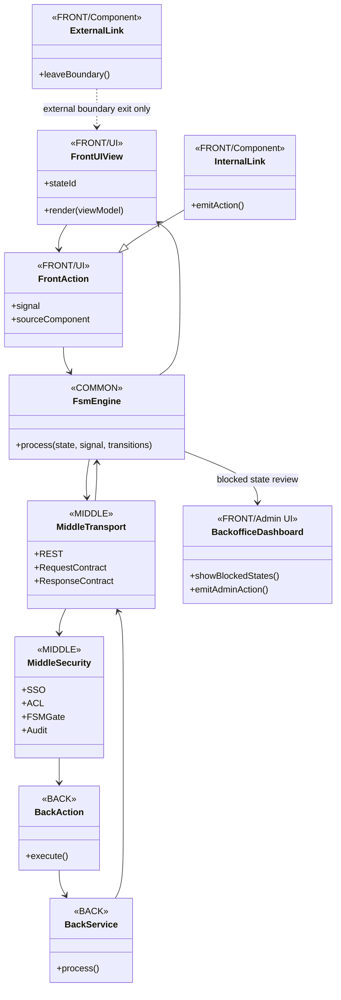
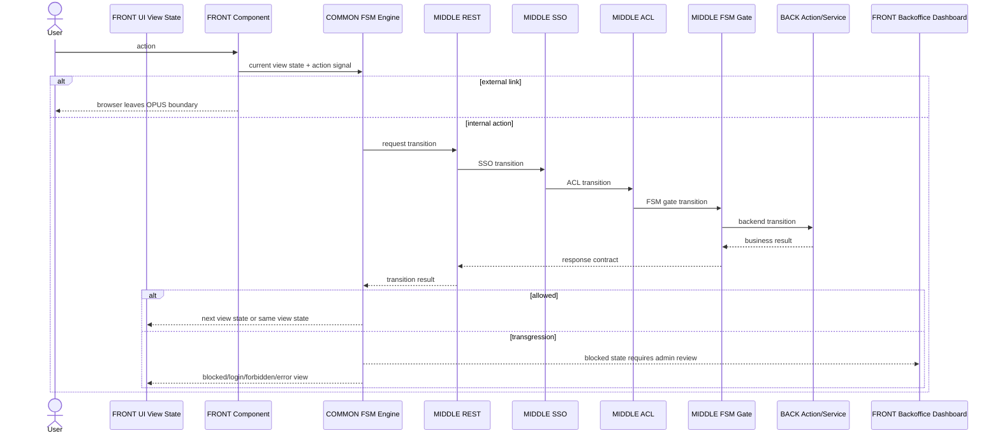

# P117SITE27 — Generated application UI FSM backoffice model

Status: implementation runner delivered.

## Goal

This palier makes the generated OPUS application carry the same architectural contract as the framework:

- `FRONT = UI`.
- `VIEW = FSM state`.
- `ACTION = FSM signal`.
- `COMMON/FSM/Engine = shared processor`.
- transitions are owned by each layer and by each application/module.
- every internal action follows `FRONT -> MIDDLE -> BACK -> MIDDLE -> FRONT`.
- REST + FSM + ACL + SSO are mandatory on internal application requests.
- transgression creates an explicit blocked FSM state.
- the backoffice dashboard is FRONT admin UI and exposes blocked states for administrator action.

## Generated application target tree

```text
sites/<app>/
├── frontend/
│   ├── ui/
│   ├── views/
│   ├── fsm/
│   │   ├── states/views/
│   │   └── transitions/
│   └── backoffice/
│       ├── dashboard/
│       └── fsm/
│           ├── states/
│           └── transitions/
├── middle/
│   ├── routes/
│   ├── api/
│   ├── security/
│   ├── contracts/
│   └── fsm/transitions/
├── backend/
│   ├── modules/catalog/fsm/transitions/
│   ├── fsm/states/
│   └── fsm/transitions/
└── common/
    └── fsm/
        ├── engine/
        ├── state/
        ├── contract/
        ├── result/
        └── trace/
```

## Class diagram



## End-to-end sequence



## State diagram

```mermaid
stateDiagram-v2
    [*] --> home

    home --> catalog-index: OPEN_CATALOG / REST + SSO_OK + ACL_OK + BACK_OK
    home --> login: OPEN_CATALOG / SSO_REQUIRED
    home --> forbidden: OPEN_CATALOG / ACL_DENIED
    home --> blocked: OPEN_CATALOG / CONTRACT_VIOLATION

    catalog-index --> catalog-index: SEARCH / REST + BACK_OK + SAME_VIEW
    catalog-index --> catalog-detail: OPEN_PRODUCT / REST + SSO_OK + ACL_OK + BACK_OK
    catalog-index --> blocked: INVALID_TRANSITION

    catalog-detail --> catalog-index: BACK_TO_CATALOG
    blocked --> AdminBlockedStatesView: ADMIN_REVIEW_REQUIRED

    AdminBlockedStatesView --> home: ADMIN_UNBLOCK
    AdminBlockedStatesView --> forbidden: ADMIN_REJECT
    AdminBlockedStatesView --> blocked: ADMIN_REPAIR_PENDING

    home --> ExternalBrowser: EXTERNAL_LINK
```

## Contract rules

1. A generated `frontend/views/<id>/<id>.view.json` must declare `fsm_state`.
2. A generated `frontend/fsm/states/views/front.view.states.json` must list UI View states.
3. A generated `frontend/fsm/transitions/front.ui.actions.transitions.json` must list UI actions.
4. A generated `middle/fsm/transitions/middle.rest_acl_sso.transitions.json` must list REST + SSO + ACL + FSM gate transitions.
5. A generated `backend/fsm/transitions/back.execution.transitions.json` must list backend execution transitions.
6. A generated module can own its own transition fuel, for example `backend/modules/catalog/fsm/transitions/catalog.transitions.json`.
7. `common/fsm/engine` contains the engine only, not application transition fuel.
8. Any transgression must produce a blocked FSM state, not a silent fallback.
9. Backoffice dashboard is FRONT admin UI, not BACK.

## Validation

Run:

```cmd
python tools\refactor_p117site27_generated_application_ui_fsm_backoffice.py --write
python tools\smoke_p117site27_generated_application_ui_fsm_backoffice.py
```

Expected final marker:

```text
P117SITE27_GENERATED_APPLICATION_UI_FSM_BACKOFFICE_SMOKE_OK
```
